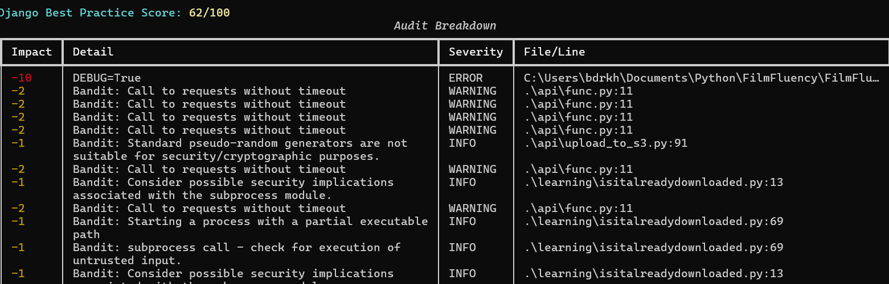

# 🛡️ DjangoBestPractice

A CLI-powered auditing tool to score your Django project out of 100 based on security, performance, and code hygiene best practices.

---

## 🚀 Features

- ✅ Static analysis of `settings.py`, models, views, templates
- 🔐 Security checks: `DEBUG=True`, missing secure headers, hardcoded secrets, Bandit integration
- ⚡ Performance checks: missing DB indexes, large static files, uncompressed media
- 🧼 Code hygiene: tests, README, requirements checks
- 🧪 Model field validation (`null=True`, `__str__`, `unique_together`)
- 📊 Output: Markdown, SARIF, JSON, colorful Rich terminal
- 🔧 `--autofix` to fix insecure settings automatically
- 📁 Custom per-project config: `.dbp.yaml`

---

## 🧰 Installation

```bash
git clone https://github.com/bdr-pro/DjangoBestPractice.git
cd DjangoBestPractice
pip install -r requirements.txt
````

---

## 🧪 Usage

Run from your Django project root (where `manage.py` lives):

```bash
python -m DjangoBestPractice manage.py
```

Or directly:

```bash
python cli.py
```

### 🔍 Optional Flags

| Flag         | Description                                                   |
| ------------ | ------------------------------------------------------------- |
| `--autofix`  | Automatically fix `DEBUG`, secure cookies, etc                |
| `--bandit`   | Run [Bandit](https://github.com/PyCQA/bandit) static analysis |
| `--markdown` | Export results to `.django_audit/report.md`                   |
| `--json`     | Export issues to `.django_audit/problems.json`                |
| `--sarif`    | Export SARIF for GitHub Security tab                          |
           |

---

## ⚙️ Configuration

Customize your checks via `.dbp.yaml` (auto-generated on first run):

```yaml
checks:
  debug: true
  cookie_secure: true
  cors: true
  secure_headers: true
  tests: true
  model_indexes: true
  hardcoded_secrets: true
  template_safe: true
```

---

## 🔒 Security Highlights

- Detects insecure headers, CSRF holes, hardcoded keys
- Validates `CORS`, `HSTS`, and secure cookies
- Integrates Bandit for deep code inspection
- Flags `eval()`, `exec()`, insecure forms

---

## 📦 Exports

Reports are saved in `.django_audit/`:

- `report.md`
- `report.sarif`
- `problems.json`
- `bandit.json`

---

## 📈 Scoring System

| Severity | Score Deduction |
| -------- | --------------- |
| High     | -10 to -5       |
| Medium   | -4 to -2        |
| Low      | -1              |

---


## 🧠 Coming Soon

- Interactive autofix prompts
- GitHub Actions workflow support
- CI pipeline mode
- Code coverage integration

---

## 🤝 Contributing

PRs, issues, and ideas are welcome! Let’s make Django apps safer and cleaner, together.

---

## 🐍 License

MIT
